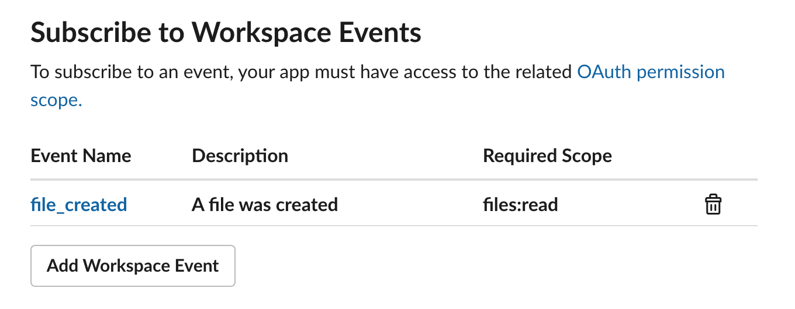

# Emoji Bot

Takes files uploaded to Slack and turns them into emojis. The `file_created` event triggers the emoji creation process.

### Why?

Adding more than a couple of emojis via the Slack UI is annoying, and bulk uploades are not currently possible. This Slack App allows you to upload files directly to Slack and have them turned into emojis automatically.

### Limitations

This Slack app authenticates as a user, not as a bot. Currently bots have no way of gaining access to the `emoji.add` api, so the app uses a user token for auth.

### Running Locally

- Get your Slack user token
  - Navigate to the `<your slack>/ustomize/emoji` page with the network tab of the dev tools open
  - Inspect any of the api requests to find your `token` that starts with `xoxs`. This is a special token that you should be very careful with. Do not share or distribute this.
- Set this token as an env variable
  ```bash
  export SLACK_BOT_TOKEN='<your xoxs token>'
  ```
- Run the Node project (you'll need real or fake AWS creds to run `serverless offline`)
  ```bash
  yarn dev
  ```
- Run ngrok with the port your Node process is exposing (default is port 3000)
  ```bash
  ngrok http 3000
  ```
- Add the Emoji Bot to Slack
  - [Add the app](https://api.slack.com/apps)
- Add an event subscription `https://api.slack.com/apps/<your app id>/event-subscriptions`
  - The `Request URL` should look like `https://<your ngrok url>/event`
  - Subscribe to the `file_created` Workspace Event.
  
  - Save
- Install the App in your workspace: `https://api.slack.com/apps/<your app id>/install-on-team`

### Upload Some Images

Just drag an image file into your Slack window. Once the file is uploaded, the App will send you a direct message with the new emoji that was added. The file name of the uploaded image will be used for the emoji name (emoji_test.gif will be :emoji_test:).


